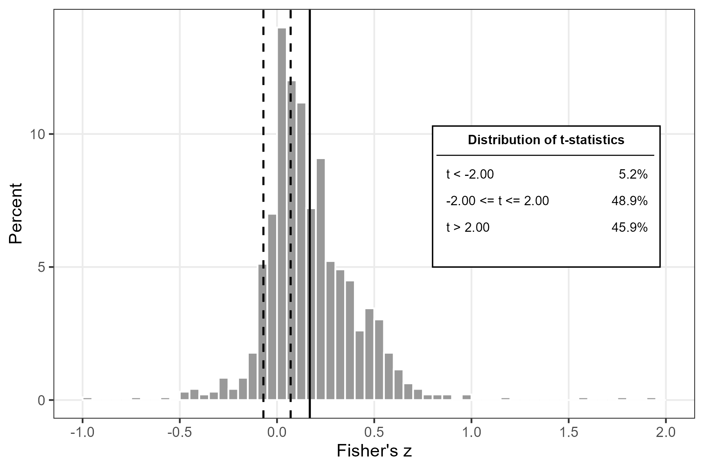
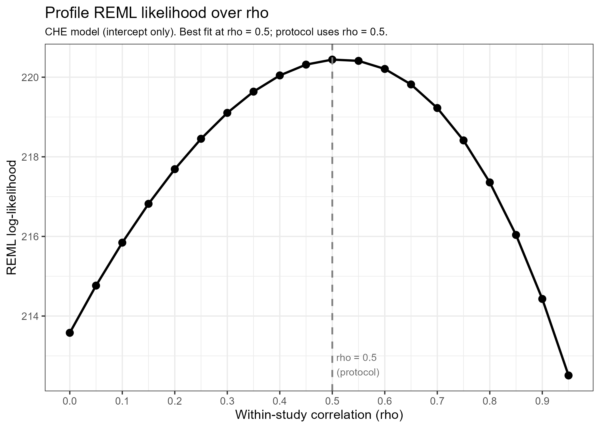
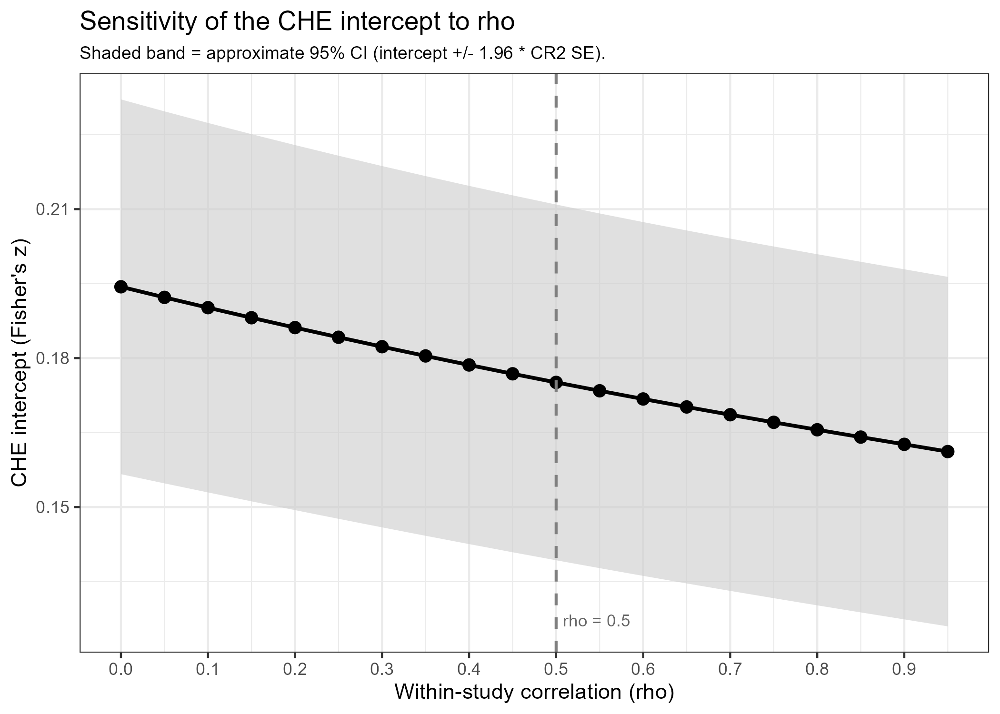
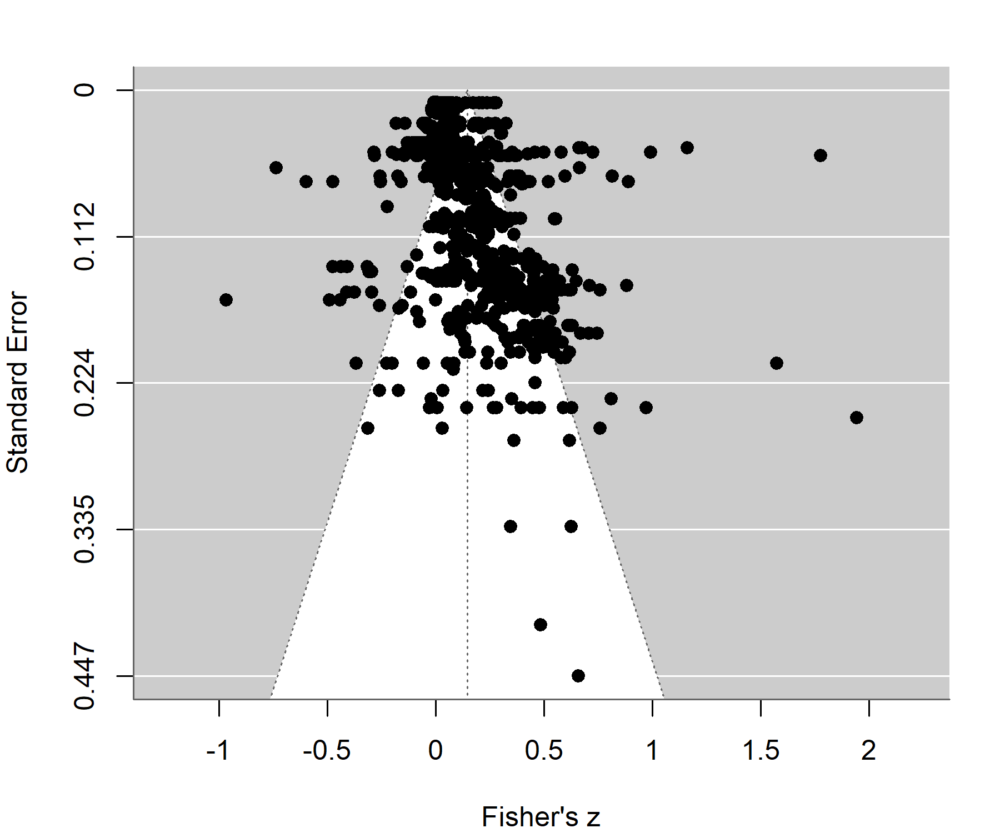
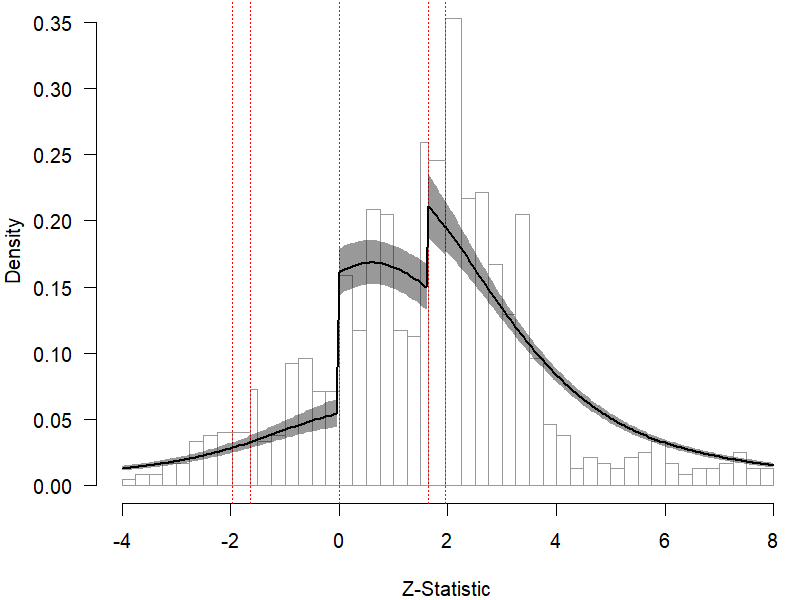
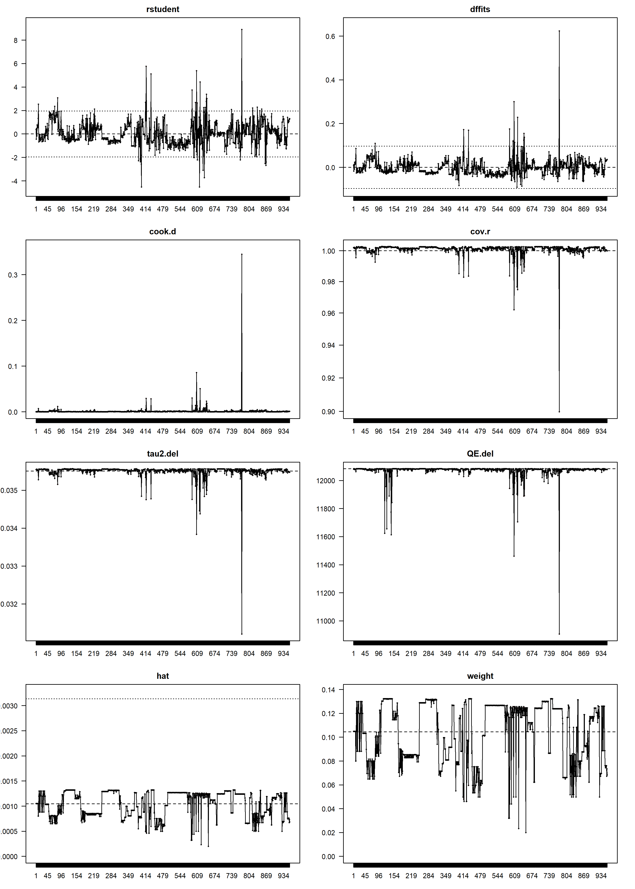
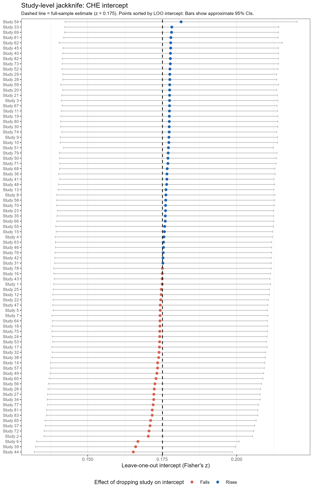

# Introduction

Meta-analysis has become a cornerstone of cumulative science across many disciplines, providing a principled framework for synthesizing quantitative evidence from multiple primary studies. As research syntheses grow in scope and ambition, however, they increasingly confront a statistical challenge that standard meta-analytic methods were not designed to handle: dependent effect size estimates. Dependence arises when individual studies contribute more than one effect size to the meta-analytic database, so that estimates from the same study share common sources of variation that render them statistically related. This protocol provides a step-by-step guide to conducting meta-analyses with dependent data.

In practice, dependent effect sizes arise in several distinct ways. A study may report effects for multiple outcome measures, such as different dimensions of economic performance or different operationalizations of a psychological construct. Effects may be estimated at multiple follow-up time points on the same sample. A study may compare several treatment groups to a common control group, generating multiple non-independent comparisons. At a higher level, dependence can also arise when multiple studies are conducted by the same research group, share overlapping samples, or belong to a tightly defined empirical tradition. In any of these cases, treating effect size estimates as if they were independent overstates the amount of independent information in the database, leading to standard errors that are biased downward and to hypothesis tests and confidence intervals that do not achieve their nominal properties.

The consequences of ignoring dependence are not limited to a loss of inferential validity. When effect sizes are clustered within studies, a correct working model for the dependence structure yields more efficient estimates of moderator coefficients -- that is, tighter standard errors and more powerful tests -- compared to models that treat all estimates as independent.

Over the past decade, one influential approach to handling dependence among effect sizes has developed under the label of robust variance estimation (RVE). In this framework, the analyst specifies a *working model* for the dependence structure among effect sizes, while using cluster-robust sandwich estimators to protect statistical inferences against misspecification of that model. Pustejovsky and Tipton (2022) extend this approach by showing that the correlated-and-hierarchical effects (CHE) working model provides a more realistic representation of the forms of dependence commonly found in social science meta-analyses. Unlike simpler working models, CHE allows simultaneously for between-study heterogeneity, within-study heterogeneity, and correlated sampling errors. When combined with restricted maximum likelihood (REML) estimation and small-sample-adjusted cluster-robust standard errors of the CR2 type (Tipton, 2015; Tipton and Pustejovsky, 2015), the CHE model provides a flexible and robust basis for estimation and inference when the exact dependence structure is unknown or only approximately specified.

Parallel to these developments, recent extensions of the RoBMA framework have adapted the model to handle dependent effect sizes directly. Rather than treating dependence as a nuisance to be absorbed by robust standard errors, multilevel RoBMA explicitly models the clustering of effect sizes within studies as part of its estimation framework. This extension is consequential because it allows publication bias correction and dependence adjustment to be carried out simultaneously rather than sequentially. Moreover, RoBMA does not commit to a single correction mechanism: it averages over a set of competing models of the selection process, including regression-based adjustments analogous to PET and PEESE and step-function models that allow for discrete publication thresholds. The result is a bias-corrected mean effect -- and, in the meta-regression extension, bias-corrected moderator estimates -- that is robust to uncertainty about both the dependence structure and the form of selective reporting.


## What This Protocol Covers

This protocol provides a structured, step-by-step guide to conducting a meta-analysis in the presence of dependent effect sizes. It is organized around a logical sequence of analytical decisions that a researcher encounters when working through such a synthesis: cleaning the data, describing the effect size distribution, assessing how study weights are distributed, choosing among five estimators of increasing complexity, evaluating publication bias using PET-PEESE regression, and estimating a full meta-regression with best-practice predictions. 

The protocol then extends the analysis using Robust Bayesian Meta-Analysis (RoBMA), which corrects for publication bias through model averaging rather than linear adjustment, and derives a parallel set of RoBMA-corrected best-practice predictions. A concluding section compares the PET-PEESE and RoBMA corrections and discusses what each approach implies about the underlying literature. 

Each section of the protocol explains the rationale for the steps being taken, presents the R code that implements them, and identifies any choices that the researcher must make on the basis of the output.

The protocol is grounded in several methodological papers. Pustejovsky and Tipton (2022) introduced the CHE working model and established the theoretical framework for combining it with RVE. Chen and Pustejovsky (2026) provided a comprehensive tutorial on investigating selective reporting bias in the presence of dependent effects, reviewing and extending methods that range from regression-based adjustments to step-function selection models. Pustejovsky, Citkowicz, and Joshi (2026) developed and evaluated penalized marginal likelihood estimation for step-function selection models in the dependent-effects context, demonstrating that two-stage clustered bootstrapping yields confidence intervals with acceptable coverage. The RoBMA sections draw on Maier, Bartoš, and Wagenmakers (2023), who introduced the RoBMA framework; Bartoš, Maier, Quintana, and Wagenmakers (2022), who demonstrated its implementation in JASP and R; Bartoš, Maier, Stanley, and Wagenmakers (2025), who extended RoBMA to the meta-regression setting; and Bartoš, Maier, and Wagenmakers (2026), who further extended the framework to handle dependent effect sizes through multilevel modeling.

The protocol is illustrated throughout with data from Xue, Reed, and van Aert (2024), a meta-analysis of the association between social capital and economic growth published in the *Journal of Economic Surveys*. The dataset contains 957 effect size estimates from 83 independent studies, expressed as Fisher's z-transformed partial correlation coefficients (PCCs). It is used here purely as a running example, though the reanalysis is substantive: applying current best practices to this dataset reveals a number of analytical choices in the original study that depart from the methods recommended here, making it a particularly instructive example of both how to conduct a meta-analysis with dependent effects and what can be overlooked when these methods are not applied. Every analytical step, every decision point, and every line of code in this protocol applies equally to any meta-analytic database in which effect size estimates are dependent, though modifications may be necessary; for example, when the effect size metric or data structure differs from that used in Xue et al.

## The Five Estimators

The protocol is organized around five estimators, presented in order of increasing complexity. All are estimated using the `rma.mv()` function from the `metafor` package (Viechtbauer, 2010), with cluster-robust (CR2) standard errors from `clubSandwich` (Pustejovsky, 2020). The five models differ in how they specify the random-effects structure and the variance-covariance matrix of the effect sizes.

**Fixed effects (FE).** No random effects. Each effect size is weighted by the inverse of its known sampling variance. This estimator assumes that the true effect is identical across all studies and all effect sizes, and is included primarily as a baseline for likelihood ratio testing.

**Random effects (RE).** A single study-level random effect, implemented as `~ 1 | obs` on the individual effect size identifier. This is the conventional meta-analytic model and assumes that within-study estimates are conditionally independent.

**Correlated effects (CE).** A single study-level random effect, implemented as `~ 1 | newid`, combined with an imputed block-diagonal covariance matrix that allows for a constant within-study sampling correlation (denoted $\rho$). This model captures correlated sampling errors but does not allow for within-study heterogeneity in the true effect. In other words, it assumes a common true effect across all estimates within a study, with deviations attributable solely to correlated sampling errors arising from shared samples, correlated outcome measures, and similar sources.

**Hierarchical effects (HE).** Two random effects, `~ 1 | newid/obs`, with a diagonal variance matrix. This model allows for both between-study and within-study heterogeneity in the true effect, but does not model correlated sampling errors.

**Correlated and hierarchical effects (CHE).** Two random effects, `~ 1 | newid/obs`, combined with an imputed block-diagonal covariance matrix. This model accommodates between-study heterogeneity, within-study heterogeneity, and correlated sampling errors simultaneously, and is the preferred default model following Pustejovsky and Tipton (2022).

For the CE and CHE models, the imputed block-diagonal covariance matrix is constructed using `vcalc()` from `metafor`, under the assumption of a constant within-study sampling correlation $\rho$. The choice of $\rho$ is not identified from the data and must be specified by the researcher. The protocol uses $\rho = 0.5$ as the default, following common practice, with a sensitivity analysis over a grid of values presented in Section 4.

## Document Structure

The protocol proceeds in the following order. Section 2 covers data cleaning and quality checks, which must be completed before any analysis. Section 3 addresses preliminary analysis: variable descriptions, effect size descriptives, and the distribution of study weights. Section 4 covers the choice of $\rho$. Section 5 presents the five estimators side by side and discusses model selection. Section 6 turns to publication bias, using funnel plots and PET-PEESE regression. Section 7 estimates a full meta-regression using Bayesian Model Averaging and the CHE model. Section 8 derives best-practice effect size predictions. Section 9 extends the analysis using Robust Bayesian Meta-Analysis (RoBMA), comparing the PET-PEESE correction to a model-averaged Bayesian approach and deriving RoBMA-corrected best-practice predictions. Section 10 compares the two approaches directly. Section 6 also includes a robustness-checks subsection presenting two alternative publication bias methods (CHE-ISCW-PET-PEESE and step-function selection models). One appendix addresses outlier and influence analysis.

Each section follows the same structure: a methodological narrative explaining what is being estimated and why, a code chunk that sources the relevant R script, and a display chunk that reads the output back into the document. After the output is displayed, a brief interpretive note highlights what the researcher should examine and identifies any decision that must be made before proceeding.

## Software Setup

All analyses are conducted in R. The following packages must be installed before running any script in this protocol. The `metaselection` package, used for the step-function selection models in Section 6's robustness checks, must be installed from GitHub.

```{r}
#| label: install-packages

# Install standard packages from CRAN
install.packages(c(
  "metafor",       # meta-analytic models
  "clubSandwich",  # cluster-robust (CR2) standard errors
  "tidyverse",     # data manipulation and plotting
  "haven",         # reading Stata .dta files
  "writexl",       # writing Excel output
  "openxlsx",      # writing Excel output with formatting (Tables 3, 6, 8, 9, 10)
  "kableExtra",    # table formatting in display chunks
  "BMS",           # Bayesian Model Averaging (Section 7)
  "RoBMA",         # Robust Bayesian meta-analysis (Section 9)
  "future",        # parallel processing (Section 6 robustness checks)
  "progressr"      # bootstrap progress display (Section 6 robustness checks)
))

# Install metaselection from GitHub (needed for Section 6's robustness checks only)
# install.packages("remotes")
remotes::install_github("jepusto/metaselection")
```

Once packages are installed, set the working directory to the folder containing all scripts and data files. All scripts in this protocol assume a common working directory; replace the path below with the location of that folder on your own machine.

```{r}
#| label: setup

# Replace this path with the location of your scripts and data files
setwd("C:/PROTOCOL OF MAs WITH DEPENDENT DATA")

library(readxl)     # read_excel() used in all display chunks
library(kableExtra) # column_spec() used for table formatting
```

---

# Data Cleaning and Quality Checks

Before any analysis can proceed, the raw dataset must be inspected and cleaned. This step is essential for any meta-analysis, but it requires particular care when effect sizes are dependent, because errors in coding -- such as duplicated observations or inconsistent standard errors -- can be difficult to detect when multiple estimates come from the same source.

## What the cleaning script does

The script `Protocol_DataCleaning.R` runs eight sequential quality checks on the raw dataset (`SCData (20240508).dta`). These checks address the most common data problems in meta-analytic databases:

1. **Missing values.** Identifies observations with missing values in any variable.
2. **Duplicates and coding conflicts.** Detects rows that are exact copies of one another (true duplicates) and rows from the same study that share the same effect size, standard error, and t-statistic but differ in their coding of other variables (coding conflicts).
3. **Valid ranges.** Verifies that binary variables contain only 0/1 values and that key continuous variables (standard errors, degrees of freedom, publication year) fall within plausible bounds.
4. **Mutual exclusivity.** Verifies that each set of mutually exclusive dummy variables (social capital type, outcome type, geographic level, region, endogeneity treatment) sums to exactly one for every observation.
5. **Internal consistency of derived variables.** Verifies that the Fisher's z, partial correlation, and t-statistic variables satisfy their defining relationships (z = atanh(pcc); t = pcc/se).
6. **Standard error consistency.** Flags observations whose reported standard error is smaller than the value implied by the reported degrees of freedom, distinguishing minor discrepancies (likely rounding artifacts) from major ones (possible coding errors).
7. **Outlier effect sizes.** Flags observations with exceptionally large effect sizes, using both an absolute threshold and a distance-from-the-mean criterion.
8. **Small degrees of freedom.** Flags observations from regressions with very few degrees of freedom, which may yield unreliable standard errors.

No observations are dropped during this step. Instead, the observation-level checks add binary flag variables to the dataset, and an omnibus flag (`flag_any`) marks any observation that triggers at least one of them. The researcher inspects these flags and decides which, if any, to act upon before proceeding.

The script also exports a five-sheet Excel report (`DataCleaning_Report.xlsx`) summarizing each check, a flagged dataset (`SCData_flagged.dta`) containing the original data plus the flag columns, and a processed dataset (`SCData_processed.rds`) that all subsequent analysis scripts load. For this protocol, the processed dataset is identical to the raw data — no flagged observations are dropped, in order to maintain comparability with Xue, Reed, and van Aert (2024). In your own work, after inspecting `DataCleaning_Report.xlsx` and deciding which flagged observations to drop or revise, make those changes to the flagged dataset and save the result as `SCData_processed.rds` before running any subsequent scripts. We recommend keeping a log file documenting every change made and the reason for it.

**Note for readers using non-Stata data.** The cleaning script reads the raw dataset using `read_dta()` from the `haven` package, which is specific to Stata `.dta` files. If your data are stored in a different format, replace that line with the appropriate R function: `read.csv()` for CSV files, `read_excel()` from `readxl` for Excel files, or `load()` / `readRDS()` for R-native formats. All subsequent scripts load `SCData_processed.rds` using `readRDS()` and require no modification for non-Stata data.

## Run the cleaning script

```{r}
#| label: data-cleaning

source("Protocol_DataCleaning.R")
```

## Inspect the output

```{r}
#| label: data-cleaning-report
#| eval: true

library(readxl)

# View a summary of each quality check
read_excel("DataCleaning_Report.xlsx", sheet = 1)
```

**What to look for.** The researcher should examine whether any observations are flagged by the major standard error check or the coding conflict check, as these are the most likely to reflect genuine errors. Minor standard error discrepancies and small degrees of freedom flags are often a normal feature of the literature and may not require action. True duplicates, if present, should always be investigated. The outlier flags identify extreme effect sizes that may warrant examination in the outlier analysis (the Appendix), but they do not automatically indicate erroneous data.

**Decision point.** After inspecting the flags and the `DataCleaning_Report.xlsx`, the researcher decides whether to exclude or revise any observations. If changes are made, they should be saved to `SCData_processed.rds` — the file that all subsequent analysis scripts load. We recommend keeping a log file documenting every change made and the reason for it. For the illustrative dataset used here, no observations are excluded; the processed dataset is identical to the raw data, and all 957 effect sizes proceed to analysis.

---

# Preliminary Analysis

Before estimating any formal meta-analytic model, it is useful to characterize the dataset: what variables are available, how the effect sizes are distributed, and how study weights are allocated under alternative estimators. These three steps correspond to @tbl-table1 through @tbl-table3 and @fig-figure1 of the protocol.

## Variable Descriptions

@tbl-table1 provides a reference guide to all variables in the dataset. For continuous variables, it reports the mean, minimum, and maximum. For binary variables, it reports the mean (which equals the proportion of ones) and the number of studies contributing at least one observation with a value of one. The latter is reported to flag cases where a variable takes the value one for many observations but those observations come from only a small number of studies, which can make meta-regression estimates for that variable unreliable. Reference categories are marked with an asterisk.

This table serves two purposes. First, it allows the reader to verify that the dataset matches expectations and that no variables have unexpected ranges or implausible values. Second, it provides the descriptive information needed to interpret the meta-regression coefficients in Section 7, where understanding what each variable represents and what value of one means is essential for forming best-practice predictions.

### Run the script

```{r}
#| label: table1-run

source("Protocol_Table1.R")
```

### Display the output

```{r}
#| label: tbl-table1
#| eval: true
#| tbl-cap: "Variable descriptions."

library(readxl)
library(knitr)

tbl1 <- read_excel("Table1_Protocol.xlsx")

# The footnote is stored as its own row in the sheet (in the Group column),
# with a blank spacer row above it. Extract the note text, then drop both
# non-data rows, matching the same display-time-filtering convention used
# for Table 6's panels, Table 9, and the robustness-checks table.
note_text1 <- tbl1$Group[grepl("^Note:", tbl1$Group)]
tbl1 <- tbl1[!is.na(tbl1$Group) & !grepl("^Note:", tbl1$Group), ]

tbl1 |> knitr::kable()

knitr::asis_output(paste0(
  '<div style="margin-top: 0.25em; text-align: left;"><p><em>', note_text1, '</em></p></div>\n\n'
))
```

**What to look for.** Verify that the effect size variable (`z`) and its standard error (`sez`) have plausible ranges: Fisher's z values for partial correlations are typically bounded between roughly -1 and 1, and standard errors should be positive. For the binary control variables, note which categories are underrepresented, as variables with very few observations coded as one may be collinear with others or may be unreliable in the meta-regression.

---

## Effect Size Descriptives and Distribution

@tbl-table2 reports descriptive statistics for the effect size distribution: the mean, median, standard deviation, minimum, and maximum of the effect size estimates and their t-statistics, along with the distribution of degrees of freedom. @fig-figure1 displays a histogram of the Fisher's z values, annotated with the mean and with vertical reference lines at the Doucouliagos (2011) threshold of $|z| = 0.07$, the boundary between negligible and small effects in the partial correlation literature.

Doucouliagos (2011) proposed benchmarks of 0.07, 0.17, and 0.33 for small, medium, and large partial correlations in economics, derived from the observed distribution of over 22,000 partial correlations in economics. These are different from Cohen's (1988) thresholds of 0.10, 0.30, and 0.50 because the latter were developed for zero-order (simple) correlations. Applying Cohen's thresholds to partial correlations would systematically understate practical significance, since partial correlations are mechanically smaller once other variables have been partialled out. 

Doucouliagos (2011) was never formally published and is not readily available online, but it remains the standard benchmark for partial correlations in the applied economics meta-analysis literature, with over 150 citing papers recorded on RePEc/IDEAS. Only the small-effect threshold (0.07) is drawn on @fig-figure1. Researchers working with other effect size metrics should replace the Doucouliagos (2011) benchmarks with thresholds appropriate to their context. These values can be substituted directly into the figure script.

An inset table in the figure shows the breakdown of observations by the statistical significance of the associated t-statistic.

These two outputs together give an initial picture of where the evidence is concentrated in the effect size distribution and how much of the literature reports statistically significant results -- information that is directly relevant to the publication bias analysis in Section 6.

### Run the script

```{r}
#| label: table2-figure1-run

source("Protocol_Table2_Figure1.R")
```

### Display the output

```{r}
#| label: tbl-table2
#| eval: true
#| tbl-cap: "Descriptive statistics for the effect size distribution."

read_excel("Table2_Protocol.xlsx") |> knitr::kable()
```

```{r}
#| label: fig-figure1
#| eval: true
#| fig-cap: "Distribution of Fisher's z-transformed effect sizes."

library(knitr)


```

**What to look for.** The mean and median effect sizes provide an initial (unadjusted) sense of the central tendency of the literature. An excess of statistically significant results, visible in the inset table, raises the possibility of selective reporting and motivates the formal tests in Section 6. A distribution that is noticeably skewed or multimodal may suggest that the literature is not homogeneous and that moderator analysis is warranted.

---

## Study Weights and Heterogeneity

@tbl-table3 examines how study weights are distributed across the literature under fixed-effects (FE), random-effects (RE), and hierarchical effects (HE) estimation. Because the dataset contains multiple effect sizes per study, the script first aggregates to the study level by computing a precision-weighted mean effect size for each of the 83 studies, and then fits FE and RE models to the 83 study-level values. The HE weights are computed differently: they come from the full observation-level multilevel model, using the row sums of its GLS weight matrix summed to the study level. In all three cases, the weight distribution reflects the relative information contributed by each study, rather than the number of effect sizes it reports.

The table reports summary statistics of the weight distribution (mean, median, selected percentiles) and the shares of total weight captured by the three and ten largest contributors. It also reports $I^2$, the between-study heterogeneity standard deviation $\hat{\tau}$ (RE and HE), and the within-study standard deviation $\hat{\omega}$ (HE only), which together characterize the degree of heterogeneity.

### Run the script

```{r}
#| label: table3-run

source("Protocol_Table3.R")
```

### Display the output

```{r}
#| label: tbl-table3
#| eval: true
#| tbl-cap: "Study weights and heterogeneity."

readxl::read_excel("Table3_Protocol.xlsx") |> knitr::kable()
```

**What to look for.** Under FE weighting, weight is concentrated in the most precise (typically largest) studies; under RE weighting, weights are more equalized because the between-study variance places a ceiling on how much any single study can contribute. HE weighting behaves like RE in this respect, since its variance components likewise cap the contribution of any single study. A highly unequal weight distribution -- where, say, the three largest studies account for the majority of total FE weight -- indicates that the overall FE estimate is driven by a small number of studies, which is worth keeping in mind when interpreting results. A large $I^2$ value (conventionally above 75%) indicates substantial between-study heterogeneity that cannot be explained by sampling error alone, reinforcing the case for random-effects estimation and motivating the moderator analysis.

---

# The Choice of Rho

Before estimating the five models in the next section, the researcher must decide on a value for $\rho$, the assumed within-study sampling correlation used to construct the imputed block-diagonal covariance matrix for the CE and CHE models. This parameter governs the degree to which effect size estimates from the same study are treated as correlated in their sampling errors, and it cannot be identified from the data.

In most applications, the true value of $\rho$ is unknown because primary studies rarely report the correlations between their outcome measures or model specifications. The standard practice is to assume a plausible constant value -- commonly $\rho = 0.5$ -- and to report sensitivity analyses documenting how results change across a range of alternatives. The sensitivity analysis below profiles the REML log-likelihood of the intercept-only CHE model over a grid of 20 candidate values of $\rho$ (from 0 to 0.95 in steps of 0.05), identifying the value that maximizes the likelihood and plotting the CHE intercept as a function of $\rho$.

**Decision point.** The researcher should run this analysis before proceeding to the five estimators in the next section. If the profile likelihood is flat over a wide range of $\rho$ values and the intercept is stable, then the choice of $\rho$ matters little and the default of 0.5 can be retained. If the likelihood is sharply peaked at a value far from 0.5, the researcher may choose to use the likelihood-maximizing value instead. Whatever value is chosen, it should be reported along with the sensitivity analysis (figures and table).

```{r}
#| label: rho-sensitivity-run

# Note: this script takes approximately 6 minutes to run.
source("Protocol_RhoSensitivity.R")
```

```{r}
#| label: rho-sensitivity-figures
#| eval: true

library(knitr)



```

```{r}
#| label: rho-sensitivity-table
#| eval: true

read_excel("Table_RhoSensitivity.xlsx") |> knitr::kable(caption = "CHE results across values of rho")
```

**What to look for.** The profile likelihood is maximized at $\rho = 0.5$, so the default value coincides with the likelihood-maximizing one in this dataset. The CHE intercept is not perfectly flat across the grid: it declines steadily from 0.194 at $\rho = 0$ to 0.161 at $\rho = 0.95$, confirming that the choice of $\rho$ does have some effect on the point estimate, though the change is modest relative to the estimate's standard error (which stays close to 0.018--0.019 throughout).

For write-up purposes, the two figures above and this summary are typically sufficient for the main text of a manuscript; the full grid in the table above is best relegated to a supplementary or online appendix, where it remains available for verification without consuming space in the main text.

After inspecting these figures and the table above, choose the value of $\rho$ to use throughout the main analysis. The default used in this protocol is $\rho = 0.5$.

---

# The Five Estimators

With the data cleaned and the choice of $\rho$ resolved, the researcher is ready to estimate the five meta-analytic models. @tbl-table4 presents all five side by side in a single table, allowing direct comparison of the intercept (the overall mean effect), the standard error, the variance components ($\hat{\tau}$ and $\hat{\omega}$), and likelihood ratio tests.

## Estimation strategy

All models are estimated using `rma.mv()` from `metafor`. REML is used for the main reported results (the intercept and variance components). ML estimation is used only for the purpose of computing likelihood ratio statistics, since likelihood ratio tests require that both nested models be estimated by the same method (ML rather than REML). Cluster-robust standard errors of the CR2 type (Tipton and Pustejovsky, 2015) are computed using `coef_test()` from `clubSandwich`, with clustering at the study level (`newid`).

The CR2 standard errors are used for all inference throughout this protocol. They are preferable to the model-based standard errors produced by `rma.mv()` because they remain valid even when the working model for the dependence structure is misspecified -- which, given the complexity of real meta-analytic data, should be considered the norm rather than the exception (Pustejovsky and Tipton, 2022).

## Likelihood ratio tests

Three likelihood ratio tests are reported in @tbl-table4. The first tests RE against FE: a significant result indicates that between-study heterogeneity is present and that a fixed-effects model is inadequate. The second tests HE against RE: a significant result indicates that within-study heterogeneity (the $\omega^2$ component) is non-negligible, meaning that effect sizes vary meaningfully within studies beyond what is captured by a single study-level random effect. The third tests CHE against CE: a significant result indicates that the combination of correlated sampling errors and within-study heterogeneity fits the data better than correlated sampling errors alone. A direct likelihood ratio test of CHE against HE is not available because the two models use different covariance matrices. Informal evidence can nonetheless be obtained from the profile log-likelihood figure in Section 4: since HE is equivalent to CHE with $\rho = 0$, a profile log-likelihood that is maximized at $\rho > 0$ constitutes evidence in favor of CHE over HE.

These tests inform model selection, but they should not be treated as the sole criterion. The CHE model is the recommended default for most meta-analytic applications because it imposes the weakest assumptions about the dependence structure (Pustejovsky and Tipton, 2022). Even if one or more of the likelihood ratio tests fails to reach conventional significance levels, the researcher may prefer to retain CHE as the working model on substantive grounds.

## Run the script

```{r}
#| label: table4-run

# Note: this script takes approximately 2 minutes to run.
source("Protocol_Table4.R")
```

## Display the output

```{r}
#| label: tbl-table4
#| eval: true
#| tbl-cap: "The five estimators."

read_excel("Table4_Protocol.xlsx", col_types = "text") |> knitr::kable()
```

**What to look for.** The primary quantity of interest is the CHE intercept, which gives the overall mean effect after accounting for both between-study and within-study heterogeneity and for correlated sampling errors. The variance components $\hat{\tau}$ and $\hat{\omega}$ decompose total heterogeneity into its between-study and within-study portions. In this dataset, the two components are similar in magnitude ($\hat{\tau} = 0.127$, $\hat{\omega} = 0.157$ under CHE), indicating that heterogeneity is distributed roughly equally within and between studies. When $\hat{\omega}$ is large relative to $\hat{\tau}$, moderator variables that vary within studies (such as the type of outcome measure) are likely to be more informative than those that vary only between studies.

**Decision point.** The likelihood ratio tests indicate whether the additional variance components of each model represent a statistically significant improvement in fit. These results, combined with the informal evidence from the profile log-likelihood figure in Section 4 that the REML log-likelihood is maximized at $\rho > 0$, inform the choice of working model. In this application, both sources of evidence support the CHE model, which is therefore selected as the preferred estimator for all subsequent analysis.

---

# Publication Bias

A persistent concern in any meta-analysis is selective reporting: the possibility that the available effect size estimates are not a representative sample of all research conducted on the topic, because studies or results with statistically significant findings are more likely to be reported and published. If selective reporting is present, meta-analytic estimates are biased upward, since the literature over-represents positive, significant results.

This section addresses publication bias in three steps. A funnel plot provides a first-look, visual diagnostic. This is followed by FAT-PET regression, which provides a formal test and a bias-corrected estimate of the mean effect. A sensitivity analysis using the PEESE specification (Table 5S) is always reported for transparency, but is preferred over PET only if the CHE intercept in Panel B of @tbl-table5 is statistically significant and positive. The third step presents recently proposed estimators that explore alternative approaches to handling publication bias in the context of dependent effect sizes. 

## Funnel Plot

The funnel plot is a scatterplot of effect sizes against their standard errors. In the absence of selective reporting, it should be approximately symmetric around the pooled estimate: small studies with large standard errors scatter widely around the center, while large studies cluster tightly near the pooled effect. Asymmetry -- in particular, a tendency for small studies to cluster on the side of larger effects -- is a visual signal of small-study effects, which may reflect selective reporting.

The funnel plot is constructed using a univariate RE model estimated by `rma()` rather than `rma.mv()`. This is conventional: the funnel plot is a descriptive tool and does not depend on the full multivariate dependence structure. Its purpose is purely visual and motivational.

### Run the script

```{r}
#| label: figure2-run

source("Protocol_Figure2.R")
```

### Display the output

```{r}
#| label: fig-figure2
#| eval: true
#| fig-cap: "Funnel plot of effect sizes against standard errors."


```

**What to look for.** Pronounced asymmetry -- where the lower portion of the funnel (small studies) is denser on the positive side -- is consistent with selective reporting of positive results. However, funnel plot asymmetry can also arise from genuine heterogeneity, methodological differences correlated with study size, or other sources unrelated to publication bias. The funnel plot should therefore be treated as suggestive rather than conclusive, and its visual message should be cross-checked against the formal tests in @tbl-table5.

---

## FAT-PET Regression

The funnel asymmetry test (FAT) and precision-effect test (PET), due to Egger et al. (1997) and Stanley and Doucouliagos (2014) respectively, translate the visual inspection of the funnel plot into a formal regression framework. The FAT-PET regression takes the form

$$T_{ij} = \beta_0 + \beta_1 \cdot \text{SE}_{ij} + \text{controls} + u_j + v_{ij} + e_{ij},$$

where $\text{SE}_{ij}$ is the standard error of effect size estimate $i$ from study $j$. The slope coefficient $\hat{\beta}_1$ is the FAT test: a significantly positive estimate indicates that larger effects are observed precisely where standard errors are larger, which is consistent with selective reporting of significant results. The intercept $\hat{\beta}_0$ is the PET estimator of the mean effect net of bias: it represents the predicted effect size for a hypothetical study with a standard error of zero (that is, a study of infinite precision, which cannot have been selectively reported on the basis of significance).

@tbl-table5 is organized in two panels. Panel A includes the standard error (`sez`) as the only regressor, following the basic FAT-PET specification. Panel B adds the full set of 18 study characteristics as controls. In both panels, all control variables are centered at their sample means, so that the intercept directly estimates the mean effect at average covariate values net of the precision-related bias. The table reports results for all five estimators.

In the dependent-effects context, the FAT-PET models are estimated using `rma.mv()` with the full CHE variance structure and CR2 standard errors, following the approach recommended by Rodgers and Pustejovsky (2021) and Chen and Pustejovsky (2026). This extends the conventional Egger regression to the multivariate setting without abandoning the dependence structure.

### Run the script

```{r}
#| label: table5-run

# Note: this script takes approximately 4 minutes to run.
source("Protocol_Table5.R")
```

### Display the output

```{r}
#| label: tbl-table5
#| eval: true
#| tbl-cap: "FAT-PET regression results."

read_excel("Table5_Protocol.xlsx", sheet = 1, col_types = "text") |> knitr::kable(caption = "Panel A: FAT-PET without controls")
read_excel("Table5_Protocol.xlsx", sheet = 2, col_types = "text") |> knitr::kable(caption = "Panel B: FAT-PET with controls")
```

**What to look for.** The FAT slope ($\hat{\beta}_1$) tests whether there is a statistically significant association between effect size and standard error. A positive and significant slope is consistent with selective reporting. The PET intercept ($\hat{\beta}_0$) in Panel B is the key quantity: it estimates the mean effect size net of publication bias, at average values of all control variables, for the CHE model. If this intercept is not statistically distinguishable from zero, it suggests that the literature may not contain a genuine effect beyond what selection has induced.

**Decision point.** The FAT slope ($\hat{\beta}_1$) tests for selective reporting; the PET intercept ($\hat{\beta}_0$) estimates the mean effect net of bias. Because CHE is the preferred estimator throughout this protocol, the key quantity is the CHE intercept in Panel B. If this intercept is statistically significant and positive, the researcher should proceed to the PEESE sensitivity analysis (Table 5S), because Stanley and Doucouliagos (2014) show that PET underestimates the mean effect when a genuine effect is present, and PEESE's quadratic correction is more appropriate in that case. Panel A is not used as the trigger because, when the standard error is correlated with study characteristics, the univariate intercept may conflate publication bias with systematic heterogeneity rather than isolating the genuine effect beyond bias. Table 5S is also reported when any other estimator's Panel B intercept is significant, to give a complete picture of sensitivity across estimators, but the PET-PEESE choice for the preferred estimate is determined solely by CHE.

---

## PEESE Sensitivity

Table 5S substitutes the squared standard error ($\text{SE}^2$) for the standard error in the FAT-PET specification. Because the quadratic correction assumes the bias mechanism is weaker when a genuine effect is present, the PEESE intercept will generally be larger (less downward-adjusted) than the PET intercept. Table 5S is reported for all researchers as a transparency check; it becomes the preferred specification only if the CHE PET intercept in Panel B of @tbl-table5 is statistically significant and positive, in which case Stanley and Doucouliagos (2014) show that PET underestimates the true effect and PEESE's quadratic correction is more appropriate.

### Run the script

```{r}
#| label: table5s-run

# Run always. PEESE becomes the preferred estimate only if the CHE Panel B intercept
# in Table 5 is statistically significant and positive; otherwise Table 5S is reported
# as a sensitivity check.
source("Protocol_Table5S.R")
```

### Display the output

```{r}
#| label: table5s-display
#| eval: true

knitr::asis_output("**Table 5S: PEESE Publication Bias Regressions (Sensitivity Check; preferred over PET only if CHE Panel B intercept in Table 5 is significant and positive)**\n\n")
read_excel("Table5S_Protocol.xlsx", sheet = 1, col_types = "text") |> knitr::kable(caption = "Panel A: PEESE without controls")
read_excel("Table5S_Protocol.xlsx", sheet = 2, col_types = "text") |> knitr::kable(caption = "Panel B: PEESE with controls")
```

**What to look for.** Compare the CHE Panel B intercept here to the corresponding intercept in @tbl-table5. A larger PEESE intercept confirms that the quadratic correction is less aggressive than PET. If Panel A and Panel B lead to different conclusions about the size or significance of the bias-corrected effect, this discrepancy is itself informative: it suggests that part of the small-study effect visible in Panel A is explained by moderators correlated with the standard error, rather than by selective reporting alone. In this dataset, the CHE PET intercept in Panel B of @tbl-table5 was not statistically significant, so the PET estimate is retained as the preferred correction and carried forward to Table 7 and the comparison in Table 8.

---

## Robustness Checks: Alternative Publication Bias Methods

@tbl-table5 addresses publication bias through the FAT-PET regression, which tests for a linear association between effect size and standard error. However, best-practice methods for publication-bias correction under effect-size dependence remain under development. Recent research proposes two complementary methods that make different assumptions about the selection process and thus provide useful robustness checks on the PET-PEESE conclusion above: an alternative weighting scheme for the PET-PEESE regression itself (Chen and Pustejovsky, 2026), and a step-function selection model estimated via penalized likelihood (Pustejovsky, Citkowicz, and Joshi, 2026).

### CHE-ISCW-PET-PEESE

The first method, proposed by Chen and Pustejovsky (2026), replaces the conventional inverse-variance weights used in the CHE model with inverse sampling covariance weights (ISCW). Specifically, the weight matrix for each study is set to $\mathbf{W}_j = \mathbf{S}_j^{-1}$, where $\mathbf{S}_j$ is the sampling variance-covariance matrix of the effect sizes in study $j$ (constructed under the assumed $\rho$). Because ISCW allocates relatively more weight to large studies (which have smaller sampling variances and are therefore less susceptible to selective reporting), the resulting estimator is less sensitive to publication bias than the standard CHE estimator, even before any correction is applied.

The CHE-ISCW-PET-PEESE estimator combines these weights with the PET-PEESE regression framework introduced earlier in this section: it regresses effect sizes on the standard error (PET) or squared standard error (PEESE), using ISCW throughout, and reports the intercept as the bias-corrected mean effect. The PET-PEESE decision rule applies: PEESE is used if the PET intercept is significantly positive; otherwise PET is used.

### Step-Function Selection Models (3PSM and 4PSM)

The second class of methods, studied by Pustejovsky, Citkowicz, and Joshi (2026), are step-function selection models. Rather than modeling publication bias as a smooth association between effect size and standard error, these models make an explicit assumption about the selection process: the probability that an effect size is reported depends on whether its one-sided p-value falls above or below one or more conventional significance thresholds.

The three-parameter selection model (3PSM) uses a single step at $p = 0.025$ (corresponding to two-sided $p < 0.05$), distinguishing statistically significant positive results from all others. The four-parameter selection model (4PSM) adds a second step at $p = 0.50$, further distinguishing non-significant results from those in the wrong direction.

Both models are estimated using penalized marginal likelihood (PML), which treats each effect size as if it were marginally independent (modeling the marginal rather than joint distribution) and applies a penalty to regularize the likelihood. Dependence is addressed via confidence intervals, which are obtained through two-stage clustered bootstrapping. This allows the dependence among effect sizes to be accounted for without requiring it to be explicitly modeled. Pustejovsky, Citkowicz, and Joshi (2026) demonstrate through simulation that PML with two-stage bootstrap confidence intervals provides acceptable coverage across a wide range of conditions.

These models are computationally demanding. Each PML model with $R = 1999$ bootstrap replicates takes several minutes to run, and parallel processing is used to reduce the wall-clock time.

### A note on the penalty priors

The PML estimator incorporates prior penalty terms on the average effect size ($\beta$), the heterogeneity variance ($\tau^2$), and the selection parameters ($\lambda_h$). The default priors supplied by `define_priors()` are calibrated for effect size metrics that are naturally bounded in a modest range, such as Cohen's $d$, Hedges' $g$, Pearson correlations, and Fisher's $z$-transformed correlations. When the effect size metric is nonstandard -- for example, a raw regression coefficient or a semi-elasticity -- the default prior on $\beta$ may be poorly suited to the scale of the data, and the researcher should adjust it accordingly.

For a full discussion of the penalty priors, their interpretation, and guidance on how to modify them, the reader is referred to Pustejovsky, Citkowicz, and Joshi (2026).

### Run the script

```{r}
#| label: robustness-pubbias-run

# Note: this script takes approximately 5 minutes due to the bootstrap.
source("Protocol_AppendixPubBias.R")
```

### Display the output

```{r}
#| label: robustness-pubbias-table
#| eval: true

tbl <- read_excel("TableA_PubBias.xlsx")

# Drop secondary diagnostic rows not discussed in the text
rows_to_drop <- c(
  "Bias proxy selected",
  "Bias coefficient", "SE (bias coefficient)",
  "SE (lambda1)", "95% CI lambda1 (large-sample)", "95% CI lambda1 (bootstrap)",
  "SE (lambda2)", "95% CI lambda2 (large-sample)", "95% CI lambda2 (bootstrap)",
  "tau", "omega"
)
tbl <- tbl[!(tbl$Parameter %in% rows_to_drop), ]

# Drop the large-sample CI row; the note below covers CI type by column
tbl <- tbl[tbl$Parameter != "95% CI (large-sample)", ]

# Combine the two remaining CI rows into a single "95% CI" row
ci_rows <- tbl[tbl$Parameter %in% c("95% CI (Satterthwaite)", "95% CI (percentile bootstrap)"), ]
combined_ci <- ci_rows[1, ]
combined_ci$Parameter <- "95% CI"
for (col_name in names(tbl)[-1]) {
  vals <- ci_rows[[col_name]]
  combined_ci[[col_name]] <- vals[!is.na(vals)][1]
}
tbl <- tbl[!(tbl$Parameter %in% c("95% CI (Satterthwaite)", "95% CI (percentile bootstrap)")), ]
se_row_index <- which(tbl$Parameter == "SE")
tbl <- rbind(tbl[1:se_row_index, ], combined_ci, tbl[(se_row_index + 1):nrow(tbl), ])

# Not-applicable cells (e.g. lambda1/lambda2 for the CHE-ISCW columns, which
# have no selection-model thresholds) print as "--" rather than "NA",
# matching the convention used in Table 4.
tbl[is.na(tbl)] <- "--"

tbl |> knitr::kable(caption = "Alternative publication bias methods")
```

```{r}
#| label: robustness-pubbias-table-note
#| eval: true

knitr::asis_output('<div style="margin-top: 0.25em; text-align: left;"><p><em>Note: 95% CIs for the CHE-ISCW-PET-PEESE columns use CR2/Satterthwaite standard errors; 95% CIs for the PML selection model columns (PML_1step, PML_2step) use percentile intervals from the two-stage cluster bootstrap.</em></p></div>\n\n')
```

**What to look for.** The CHE-ISCW-PET-PEESE column tests whether CHE-PET-PEESE's linear correction, on its own, fully captures the effects of publication selection: compare its bias-corrected intercept to the CHE-PET-PEESE intercept in @tbl-table5. Close agreement is reassuring, since it means the extra weight ISCW places on large, less bias-prone studies is not finding anything the standard linear correction missed. Disagreement would suggest the opposite, that the linear correction alone is leaving some publication-selection-induced bias uncorrected. Either reading, however, is only as trustworthy as the weights behind it, so it should be checked against how those weights are distributed across studies before a conclusion is drawn, as discussed below.

The more important comparison is between the two PML step-function models, since they do not share PET-PEESE's assumption that selection is a smooth function of standard error alone, indifferent to the sign of the result. The lambda parameters are the key thing to inspect: evidence that they differ substantially across categories, rather than clustering uniformly near 1, indicates that PET-PEESE's functional form is not fully capturing the selection process at work in this literature.

**Decision point.** Before relying on the CHE-ISCW-PET-PEESE estimate, check how its weights are distributed across studies. Inverse sampling covariance weighting is effectively a fixed-effect (FE) weighting scheme: it weights each effect size by the inverse of its sampling variance alone. The consequence is the estimate of the overall effect is concentrated heavily on the largest studies in a sample. Thus, one should be wary when a small number of studies received an inordinate amount of weight. That would appear to be the case in this instance: per @tbl-table3, the three largest studies account for 63.3 percent of total FE weight, compared to only 4.0 percent under RE and 4.6 percent under HE. This means the CHE-ISCW-PET-PEESE estimate is less a summary of the literature as a whole than a reflection of a handful of dominant studies. As a result, the CHE-ISCW-PET-PEESE estimate is discounted here, and we focus on the PML selection models instead.

The associated lambda parameters quantify the estimated degree of selection at each threshold: values close to 1 indicate little selection (a result in that category is about as likely to be reported as a significant positive one); values far below 1 indicate strong selection against that category. $\hat{\lambda}_1$, the relative reporting probability for positive but non-significant results, is estimated at 0.75 in the one-step model and 0.79 in the two-step model, with confidence intervals that include 1 in both cases -- the data do not provide strong evidence of selection against results that are correctly signed but insignificant. 

$\hat{\lambda}_2$, available only in the two-step model, is the relative reporting probability for wrong-signed results, and is estimated at 0.27, with a bootstrap confidence interval that excludes 1: results pointing in the wrong direction are substantially under-reported relative to significant positive ones.

This asymmetry is the key finding of the step-function models, and it is one that PET-PEESE cannot represent by construction. PET-PEESE models publication bias as a smooth, linear function of the standard error alone, and its correction never depends on the sign of the reported effect. As a result, two results that share the same standard error, one wrong-signed and one merely underpowered but correctly signed, receive an identical predicted correction.

The two-step model's evidence that these two categories are treated very differently by the selection process -- weak evidence of selection against underpowered-but-correctly-signed results, but strong evidence of selection against wrong-signed ones -- indicates that the regression-based approach is, by itself, missing a real feature of how this literature's evidence base was shaped. This limitation motivates the RoBMA approach taken up in Section 9, which averages over selection models that can represent threshold-based, sign-sensitive selection mechanisms rather than assuming the smooth, standard-error-only form that PET-PEESE requires.

NOTE: For write-up purposes, the qualitative comparison discussed above is typically sufficient for the main text of a manuscript; the table itself is best relegated to a supplementary or online appendix, where it remains available for verification without consuming space in the main text.

---

# Meta-Regression

The meta-regression model extends the intercept-only framework to include substantive predictors that may explain heterogeneity in effect sizes. @tbl-table6 presents a full meta-regression with all 19 regressors -- the standard error (`sez`) plus 18 study and publication characteristics -- estimated by two methods: Bayesian Model Averaging (BMA) and the CHE model. The two panels serve distinct purposes. Panel A reports the estimates from both methods. Panel B synthesizes them into a moderator-by-moderator interpretation. The guiding principle is: **BMA informs interpretation; CHE determines estimation and inference.**

## Why two methods?

With 18 or more candidate moderators, the researcher faces a model uncertainty problem: any single specification involves selecting which variables to include, and different selections may yield materially different conclusions. The two methods address this from different angles.

BMA averages over a large number of candidate models, weighting each by its posterior probability given the data. Because BMA explores many alternative specifications, its posterior standard deviation (SD) for each coefficient captures not just sampling uncertainty but also how sensitive the estimated effect is to which other variables are included. A large posterior SD relative to the posterior mean signals that the moderator's effect is fragile across specifications; a small posterior SD signals robustness. This is something the CHE model cannot provide, since it conditions on a single fixed specification with all regressors included simultaneously. 

It is important to note, however, that the BMA implementation here uses OLS (via the BMS package), which ignores both inverse-variance weighting and the within-study dependence structure. This means that BMA posterior inclusion probabilities (PIPs) should not be treated as calibrated probabilities of true moderator importance, and BMA coefficient means should not be used for prediction. BMA is reported as a descriptive diagnostic of model uncertainty, not as an inferential tool.

The CHE meta-regression is the primary inferential model. It estimates a single specification with all 19 regressors, maintains the correct dependence structure via the imputed block-diagonal covariance matrix, and reports CR2 clustered standard errors. CHE coefficients, standard errors, and p-values are the basis for all inferential conclusions and for the best-practice predictions in @tbl-table7. This model still adjusts for publication bias in the same way as the CHE-PET-PEESE regression in @tbl-table5, through the linear sez term, so it inherits the limitation demonstrated in Section 6's robustness checks: it cannot represent selection that operates on the sign of the effect rather than only its significance. The moderator-adjusted RoBMA meta-regression in Section 9 revisits this same specification using a selection mechanism that is not restricted to that functional form.

Note that the control variables are *not* centered in @tbl-table6 (unlike in @tbl-table5). The intercept in the full meta-regression therefore has no direct substantive interpretation -- it corresponds to the mean effect when all variables take the value zero, which is typically a counterfactual scenario. Meaningful predictions from this model require recentering the covariates, which is done in @tbl-table7.

## What to look for

In Panel A, the CHE columns are the primary focus. Examine which coefficients are statistically significant and whether their signs and magnitudes accord with substantive expectations. The BMA columns provide supplementary information: where the posterior SD is large relative to the posterior mean, the moderator's estimated effect varies substantially across model specifications and should be interpreted with caution even if the CHE coefficient is significant.

Panel B summarizes the moderator evidence in two categories. A moderator is classified as **Evidence of Moderator Effect** if the CHE coefficient is statistically significant at the 10% level, and **No Evidence of Moderator Effect** otherwise. Moderators with Evidence of Moderator Effect are listed first, sorted alphabetically, followed by those with No Evidence of Moderator Effect in the same order.

Panel B also flags moderators whose BMA estimate is sensitive to model specification, defined as posterior SD exceeding the absolute posterior mean, but only among moderators with PIP $\geq$ 0.10. This floor is needed because the flag would otherwise fire almost automatically for moderators BMA has already dismissed. When a moderator's PIP is very low, its unconditional posterior mean is pulled close to zero (since BMA averages the coefficient toward zero across the many models that exclude it), which can make the SD-to-mean ratio look large purely as an artifact of dividing by a near-zero number, not because the estimate is genuinely unstable. Restricting the flag to PIP $\geq$ 0.10 limits it to moderators BMA has not already ruled out, where a large posterior SD relative to the mean instead reflects real disagreement across model specifications about how big the moderator's effect is.

## Run the script

```{r}
#| label: table6-run

source("Protocol_Table6.R")
```

## Display the output

```{r}
#| label: tbl-table6
#| eval: true
#| tbl-cap: "Meta-regression: BMA and CHE estimates."

# Panel A: BMA posterior summaries alongside CHE coefficient estimates
read_excel("Table6_Protocol.xlsx", sheet = "Panel A", col_types = "text", skip = 2) |>
  head(19) |>
  knitr::kable(align = "lrrrrr", caption = "Panel A: BMA and CHE Estimates")

# Bridging note: the extra top margin separates it visually from Panel A
# above, so it reads as the lead-in to Panel B below rather than a footnote
# tacked onto Panel A.
knitr::asis_output('<div style="margin-top: 2.5em; text-align: left;"><p><em>Note: Interpretation in the table below is anchored on CHE significance (p < 0.10). Where BMA PIP ≥ 0.10 and posterior SD > abs(posterior mean), the moderator is flagged as sensitive to model specification.</em></p></div>\n\n')

# Panel B: plain-language interpretation of each moderator
read_excel("Table6_Protocol.xlsx", sheet = "Panel B", col_types = "text", skip = 1) |>
  head(18) |>
  knitr::kable(align = "ll", escape = FALSE, caption = "Panel B: Interpretation") |>
  kableExtra::column_spec(1, width = "12em") |>
  kableExtra::column_spec(2, width = "38em")
```

**What to look for.** In this dataset, only 3 of the 18 candidate moderators show Evidence of a Moderator Effect: Endogeneity: FE (coefficient = -0.081, SE = 0.028, *p* = 0.014), Lagged dependent variable (coefficient = -0.058, SE = 0.024, *p* = 0.046), and Endogeneity: IV (coefficient = -0.039, SE = 0.018, *p* = 0.045). All three carry the expected negative sign. Correcting for endogeneity, whether through fixed effects or instrumental variables, is associated with a smaller estimated effect, consistent with part of the raw association reflecting reverse causality or omitted variable bias rather than a purely causal relationship. Including a lagged dependent variable is likewise associated with a smaller estimate, because doing so restricts the coefficient to the short-run effect net of the persistence already captured by the lag, rather than the cumulative long-run relationship.

On magnitude, measured against the Doucouliagos (2011) partial-correlation benchmarks introduced in Section 3 (small/medium/large = 0.07/0.17/0.33), all three coefficients are practically small: the IV (-0.039) and lagged dependent variable (-0.058) coefficients fall below even the small-effect threshold, and the fixed-effects coefficient (-0.081) only marginally exceeds it. Despite reaching conventional statistical significance, none of the three moderators shifts the estimated effect by an economically large amount on its own.

---

# Best-Practice Estimates

The intercept-only CHE model (@tbl-table4) estimates the mean effect averaging over all combinations of study characteristics in the database. This average includes studies that used methodologically weaker designs, suboptimal measurement, or unusual samples. A more policy-relevant quantity is the mean effect predicted by the CHE meta-regression (@tbl-table6) under a *best-practice* scenario: a set of covariate values that represents the most methodologically rigorous approach a researcher could take, given current understanding of what constitutes high-quality evidence in the literature.

## Constructing best-practice predictions

@tbl-table7 reports best-practice predictions for two scenarios -- Non-OECD/Europe and OECD/Europe -- in order to identify regional differences that may exist in how social capital interacts with economic growth. Both sets of predictions use the CHE estimates from @tbl-table6 as discussed previously. Table 7 applies those estimates to the best-practice covariate values. The predictions are obtained by recentering the control variables in the CHE meta-regression at their best-practice values, so that the model intercept directly equals the conditional prediction at those values.

The specific covariate values used to define "best practice" follow the recommendations in Table 11 of Xue, Reed, and van Aert (2024), and each reflects a design choice associated with more credible identification in this literature. For example, estimating growth rates rather than GDP levels avoids the non-stationarity and spurious-regression concerns associated with level specifications. A single social-capital regressor avoids the multicollinearity that arises when several highly correlated social-capital measures are entered jointly, which would otherwise inflate standard errors and destabilize the coefficient estimates. Specifications that incorporate instrumental variables and fixed effects reflect the most demanding available approach to addressing endogeneity. And setting se(z) = 0 removes any residual influence of publication selection from the prediction. For further details, readers are directed to Xue, Reed, and van Aert (2024).

Each scenario reports a confidence interval (reflecting estimation uncertainty only) and a prediction interval (reflecting estimation uncertainty plus the total variance from $\hat{\tau}^2$ and $\hat{\omega}^2$), for both Fisher's z and the corresponding partial correlation coefficient ($\text{PCC} = \tanh(z)$). @tbl-table7 presents the two best-practice scenarios as Panel A (non-OECD/Europe) and Panel B (OECD/Europe), matching the panel structure already used in @tbl-table6. The complete list of covariate values each panel is evaluated at is reported in a note below each panel.

## Run the script

```{r}
#| label: table7-run

# Note: this script takes approximately 37 seconds to run
# (fits the CHE model only, for both scenarios).
source("Protocol_Table7.R")
```

## Display the output

```{r}
#| label: tbl-table7
#| eval: true
#| tbl-cap: "Best-practice effect size predictions."

notes <- read_excel("Table7_Protocol.xlsx", sheet = "Notes")

# Panel A: BP#1 (non-OECD/Europe)
read_excel("Table7_Protocol.xlsx", sheet = "BP1 - Non-OECD Europe") |>
  knitr::kable(align = "lrrr", caption = "Panel A: Non-OECD/Europe")

knitr::asis_output(paste0(
  '<div style="margin-top: 0.25em; margin-bottom: 2em; text-align: left;"><p><em>Note: ',
  notes$Note[1], '</em></p></div>\n\n'
))

# Panel B: BP#2 (OECD/Europe)
read_excel("Table7_Protocol.xlsx", sheet = "BP2 - OECD Europe") |>
  knitr::kable(align = "lrrr", caption = "Panel B: OECD/Europe")

knitr::asis_output(paste0(
  '<div style="margin-top: 0.25em; text-align: left;"><p><em>Note: ',
  notes$Note[2], '</em></p></div>\n\n'
))
```

**What to look for.** The confidence interval captures uncertainty about the mean effect at the specified best-practice covariate values, holding the model fixed. The prediction interval is wider because it also incorporates the residual effect heterogeneity: even among studies that match the best-practice profile, effects will vary due to factors not captured by the model. If the prediction interval is very wide relative to the confidence interval, substantial unexplained heterogeneity remains and the best-practice estimate should be interpreted cautiously as a central tendency rather than a precise forecast.

It is also worth comparing the size of these best-practice estimates to the CHE PET intercept in Panel B of @tbl-table5 (0.042 in Fisher's z), which nets out the same publication-bias correction but evaluates the 18 study-characteristic moderators at their sample averages rather than at best-practice values. The best-practice predictions (-0.022 for non-OECD/Europe, -0.043 for OECD/Europe) are close to this average-study benchmark, and if anything slightly smaller. Despite the effort involved in recentering the meta-regression at an idealized set of covariate values, moving from the average study in the sample to the best-practice study does not meaningfully change the bias-corrected estimate. This suggests that, in this literature, publication-bias correction -- not adjustment for study design and methodology -- is doing most of the work in bringing the raw, uncorrected CHE mean (0.175, @tbl-table4) down toward zero.

---

# Further Analysis: Robust Bayesian Meta-Analysis

The analysis in Sections 6 through 8 rests on a specific approach to publication bias: the FAT-PET regression, which tests for a linear association between effect size and standard error and corrects for it by setting the standard error to zero. This approach is well established and widely used, but it embeds a particular assumption about the selection process that may not hold in all literatures. Specifically, FAT-PET assumes that the probability of publication is a monotone function of the ratio of the effect size to its standard error, so that the standard error is a sufficient proxy for the degree of selection. When this assumption fails -- for example, when selection operates on the sign of the effect rather than only its significance, or when the relationship between effect size and standard error is nonlinear -- FAT-PET may provide a distorted correction. This is not merely a hypothetical concern: Section 6's robustness checks found strong evidence of selection specifically against wrong-signed results ($\hat{\lambda}_2 = 0.27$, with a bootstrap confidence interval excluding 1) that PET-PEESE's smooth, standard-error-only form cannot represent.

Robust Bayesian Meta-Analysis (RoBMA; Bartoš et al., 2023) addresses this limitation by combining multiple models of the selection process within a Bayesian model-averaging framework. Rather than committing to a single correction method, RoBMA assigns prior probabilities to a set of competing models that include both regression-based adjustments analogous to PET and PEESE and step-function selection models analogous to the 3PSM and 4PSM described in Section 6's robustness checks. The posterior distribution over these models, updated by the data, determines which correction method receives the most weight in the final estimate. The result is a bias-corrected mean effect that is robust to uncertainty about the selection mechanism.

This section extends the protocol to include a RoBMA analysis. The primary aim is to assess whether the CHE-PET-PEESE corrected estimate from @tbl-table5 Panel B and the RoBMA corrected estimate tell the same substantive story. If they agree, the FAT-PET result is corroborated by a more flexible approach and the conclusions of the preceding sections stand on firmer ground. If they diverge, RoBMA analysis can provide a credible alternative basis for drawing conclusions about the true underlying effect, and the divergence itself is a finding worth reporting.

## What This Section Covers

The RoBMA analysis proceeds in five steps. The first fits an intercept-only multilevel RoBMA model and produces a z-plot (@fig-figure3), which displays the empirical distribution of z-statistics alongside the model-implied distribution and makes the nature and extent of publication bias directly visible. The second constructs a three-way comparison table (@tbl-table8) that places the uncorrected CHE mean, the FAT-PET corrected mean, and the RoBMA bias-corrected mean side by side, together with Bayes factors for the three model components. The third uses BIC-based moderator pre-selection (@tbl-table9) to identify which study characteristics should be included in the RoBMA meta-regression. The fourth fits the multilevel RoBMA meta-regression (@tbl-table10), estimating publication-bias-corrected moderator effects and model-averaged regression coefficients. The fifth derives best-practice effect size predictions (@tbl-table11), which are compared directly to their counterparts in @tbl-table7.

## Software Setup

The RoBMA analysis requires the `RoBMA` package (Bartoš et al., 2023). This package must be installed before running any script in this section.

```{r}
#| label: robma-install

install.packages("RoBMA")
```

```{r}
#| label: robma-setup
#| eval: true

library(RoBMA)
library(readxl)
```

---

## The Z-Plot

The starting point for the RoBMA analysis is a visual inspection of the z-statistic distribution. Each effect size in the database can be converted to a z-statistic by dividing it by its standard error. Under a model with no publication bias, the distribution of these z-statistics should be smooth and unimodal, reflecting the underlying distribution of true effects combined with sampling variability. When publication bias is present, the distribution is distorted: observations accumulate at thresholds that carry particular significance for the probability of publication.

The z-plot displays the empirical histogram of z-statistics alongside the model-averaged curve implied by the fitted RoBMA model. This curve is a fitted plot representing the family of selection models included in RoBMA, weighted by their posterior probabilities, and is shown with a pointwise 95% uncertainty band.

For this step, an intercept-only multilevel RoBMA model is fitted on the full dataset. The multilevel structure accounts for the dependence among effect sizes nested within studies, consistent with the CHE approach used throughout the preceding sections. The model is specified with `measure = "ZCOR"` because the input is Fisher's z-transformed partial correlations, and with `cluster = newid` to define the study-level clustering. The fitted model object is saved as `RoBMA_intercept_only.rds` so that Table 8 can load it without refitting.

### Run the script

```{r}
#| label: figure3-run

# Note: this script takes approximately 5 hours to run on the full dataset.
# The fitted model is saved as RoBMA_intercept_only.rds for use in Table 8.
source("Protocol_Figure3.R")
```

### Display the output

```{r}
#| label: fig-figure3
#| eval: true
#| fig-cap: "Z-plot from the intercept-only multilevel RoBMA model."


```

**What to look for.** The z-plot reveals publication bias through two distinct features of the empirical histogram that should be read against the smooth model curve. The first is a spike at z = 0, the boundary between positive and negative effect sizes. The accumulation of z-statistics just above zero reflects selection for the correct sign of the effect: studies showing a positive association between social capital and economic growth are more likely to be reported than studies showing a negative association, regardless of statistical significance. 

The second is a spike at z ≈ 1.96, the conventional threshold for two-sided statistical significance at the five percent level. The excess of z-statistics just above this threshold, relative to the model curve, is the classic signature of selective reporting based on significance. 

The model-averaged curve is the fit of RoBMA's candidate models, weighted by their posterior probabilities, to the observed histogram; it is not a bias-free counterfactual distribution. The bias-corrected mean effect is obtained separately, from the model-averaged parameter estimates reported in @tbl-table8.

The z-plot above echoes the PML step-function findings from Section 6's robustness checks: $\hat{\lambda}_2 = 0.27$, with a confidence interval excluding 1, showed strong selection against wrong-signed results, consistent with the near-absence of negative z-statistics here, while $\hat{\lambda}_1$, estimated at 0.75 to 0.79 with a confidence interval including 1, showed only weak selection against positive-but-insignificant results, consistent with their visible accumulation just above zero. 

That two different estimation approaches, one a smooth Bayesian model average, the other explicit p-value thresholds, converge on the same qualitative pattern is independent evidence that selection in this literature operates on sign, not just significance.

---

## Comparing Publication Bias Corrections

@tbl-table8 places the RoBMA bias-corrected mean alongside the two estimates from the preceding sections: the uncorrected CHE mean from @tbl-table4 and the FAT-PET corrected mean from @tbl-table5. The purpose is to determine whether RoBMA and FAT-PET are telling the same substantive story. This comparison is the analytical pivot of the RoBMA section: if the two corrected estimates agree, the additional complexity of RoBMA is not adding new information; if they diverge, the source and implications of the divergence must be examined further.

The FAT-PET corrected estimate used in this comparison is the PET intercept from the CHE model in @tbl-table5 Panel B. In the analysis of this dataset, no intercept in @tbl-table5 Panel B reached conventional statistical significance, so the PEESE sensitivity analysis (Table 5S) was not triggered and the PET intercept is the appropriate reference point for the publication bias correction.

@tbl-table8 also reports, in a second panel, the inclusion Bayes factors for the three model components estimated by the intercept-only RoBMA: the effect component (whether the mean effect is nonzero), the heterogeneity component (whether there is genuine between-study variability), and the publication bias component (whether selective reporting is present). These Bayes factors quantify the evidence in favor of each component and require no additional estimation beyond the model already fitted for @fig-figure3.

### Run the script

```{r}
#| label: table8-run

source("Protocol_Table8.R")
```

### Display the output

```{r}
#| label: tbl-table8
#| eval: true
#| tbl-cap: "Comparing publication bias corrections."

read_excel("Table8_RoBMA_Comparison.xlsx", sheet = "Comparison") |>
  knitr::kable(caption = "Panel A: Mean effect estimates across correction methods (Fisher's z scale)", digits = 3)
read_excel("Table8_RoBMA_Comparison.xlsx", sheet = "BayesFactors") |>
  knitr::kable(caption = "Panel B: RoBMA component inclusion Bayes factors", digits = 3)
```

**What to look for.** In Panel A, the key comparison is between the FAT-PET corrected mean and the RoBMA corrected mean. If these two estimates are close in magnitude, the conclusions of the preceding sections are robust to the choice of correction method and RoBMA can be reported as a corroborating sensitivity check. If they diverge substantially, the analyst should proceed to the RoBMA meta-regression in Tables 9 through 11 to investigate whether the divergence persists after conditioning on study characteristics. In Panel B, the inclusion Bayes factors characterize the evidence for each model component. A Bayes factor above 100 is conventionally considered decisive evidence; values substantially above this threshold indicate that the data are overwhelmingly consistent with the presence of that component.

**Decision point.** If the FAT-PET and RoBMA corrected means are substantively similar, report @tbl-table8 as a robustness check and stop. If they diverge, proceed to @tbl-table9.

---

## Moderator Pre-Selection

Before fitting the RoBMA meta-regression, it is necessary to determine which of the 18 candidate moderators from @tbl-table6 should be included in the model. The multilevel RoBMA meta-regression is substantially more computationally demanding than its CHE counterpart, and including all 18 moderators simultaneously would require prohibitive estimation time on standard hardware. A pre-selection step is therefore needed to reduce the moderator set to those variables most likely to contribute to the explanation of heterogeneity.

### The BIC drop-one approach

The pre-selection strategy uses the Bayesian Information Criterion (BIC) applied to the CHE meta-regression from @tbl-table6. The full CHE model with all 18 moderators plus the standard error (`sez`) is estimated by maximum likelihood rather than restricted maximum likelihood, because BIC comparisons are only valid across models estimated on the same likelihood basis. When models differ in their fixed effects -- as they do here, since each drop-one model omits a different moderator -- REML log-likelihoods are not comparable and ML must be used instead. Each of the 18 moderators is then dropped from the model one at a time, and the change in BIC relative to the full model is recorded. A positive delta-BIC -- meaning BIC increased when the variable was dropped -- indicates that the variable improves fit and should be retained. A negative delta-BIC indicates that the variable can be excluded without penalty.

It is important to note that `sez` is included in the CHE models for this selection exercise but is not itself a candidate for dropping, and it will not be carried forward into the RoBMA meta-regression. The reason is that RoBMA corrects for publication bias internally through its model-averaging framework, which includes both regression-based and selection-model approaches. Adding `sez` as an explicit moderator in the RoBMA meta-regression would double-count the precision effect and conflate the publication bias correction with the substantive moderator analysis.

Moderators that cause convergence failures when dropped are treated as retained by default. If the model cannot be estimated without a particular variable, that variable is sufficiently entangled with the other regressors that its exclusion cannot be straightforwardly evaluated.

### A note on the limitations of this approach

Readers should be aware that BIC-based pre-selection is a pragmatic compromise rather than the methodologically ideal approach to moderator selection within a RoBMA framework. A fully coherent Bayesian treatment would pass all candidate moderators to RoBMA simultaneously and allow the model's own averaging mechanism to determine inclusion through posterior inclusion probabilities, exactly as RoBMA does for the publication bias correction. The pre-screening step introduced here is a form of pre-testing: the moderator inclusion probabilities and coefficients reported in @tbl-table10 condition on the pre-selected model rather than averaging over the uncertainty about which moderators to include, which may overstate precision to some degree. Researchers with access to faster computing hardware or working with smaller datasets are encouraged to skip this step and run the full RoBMA meta-regression with all candidate moderators directly.

### Run the script

```{r}
#| label: table9-run

# Note: this script takes approximately 15 minutes to run.
source("Protocol_Table9.R")
```

### Display the output

```{r}
#| label: tbl-table9
#| eval: true
#| tbl-cap: "BIC-based moderator pre-selection for RoBMA meta-regression."

tbl <- read_excel("Table9_BIC_ModeratorSelection.xlsx")

# The footnote is stored as its own row in the sheet, with a blank spacer
# row above it. Extract the note text, then drop both non-data rows.
note_text <- tbl$Variable[grepl("^Note:", tbl$Variable)]
tbl <- tbl[!is.na(tbl$Variable) & !grepl("^Note:", tbl$Variable), ]

tbl |> knitr::kable(digits = 3)

knitr::asis_output(paste0(
  '<div style="margin-top: 0.25em; text-align: left;"><p><em>', note_text, '</em></p></div>\n\n'
))
```

**What to look for.** The delta-BIC column is the key output. Variables with a positive delta-BIC are retained for the RoBMA meta-regression; those with a negative delta-BIC are excluded. Convergence failures are treated as retains and should be noted explicitly in reporting. The researcher should also consider whether any moderator excluded by BIC has a strong theoretical rationale that might justify its inclusion regardless of the BIC result. Note that the four regional dummies will be added to the Table 10 model regardless of their BIC performance, since they are required for the best-practice predictions in Table 11.

---

## RoBMA Meta-Regression

@tbl-table10 presents the multilevel RoBMA meta-regression with the moderators retained from @tbl-table9, plus the four regional dummies needed for @tbl-table11. Its purpose is twofold: to estimate which study characteristics are genuinely associated with variation in effect sizes after correcting for publication bias, and to provide the model-averaged coefficients from which the best-practice predictions in @tbl-table11 are derived. 

This provides an alternative, arguably more credible, answer to the heterogeneity question than @tbl-table6 because the CHE meta-regression in @tbl-table6 corrects for publication bias through a single linear sez term. This implicitly assumes selective reporting operates uniformly across the sample, regardless of moderator values. If instead the severity of selective reporting depends on those same study characteristics, the sez term cannot capture that interaction. The resulting bias is then absorbed into the moderator coefficients themselves, contaminating the estimated moderator effects. RoBMA addresses this by estimating publication bias jointly with moderator effects, using a model-averaged combination of selection mechanisms rather than a single fixed linear form.

### Model specification

The moderators entered in the model are those retained by the BIC pre-selection in @tbl-table9. In addition, all four regional dummy variables (Reg_OECDEurope, Reg_US, Reg_Africa, and Reg_Asia, with Reg_Other as the omitted reference category) are included regardless of their BIC performance, because they are required to construct the two best-practice scenarios in @tbl-table11. This mirrors the approach in @tbl-table6 and @tbl-table7, where all four regional dummies were included with Reg_Other as the reference.

The standard error (`sez`) is not included as a moderator, for the reasons described in the @tbl-table9 section above. Continuous moderators are standardized internally by RoBMA, making the prior distributions scale-invariant and centering the intercept on the grand mean effect. This means raw covariate values can be passed directly to the prediction step in @tbl-table11 without manual standardization. Categorical moderators use mean-difference contrasts by default, modeling each category's deviation from the grand mean rather than from a single reference category. The model is fit using standard MCMC settings with parallel chains, and the fitted model object is saved as `RoBMA_metaregression.rds` for use in Table 11.

### Run the script

```{r}
#| label: table10-run

# Note: this script takes approximately 4 hours to run.
# The fitted model is saved as RoBMA_metaregression.rds for use in Table 11.
source("Protocol_Table10.R")
```

### Display the output

```{r}
#| label: tbl-table10
#| eval: true
#| tbl-cap: "Multilevel RoBMA meta-regression."

read_excel("Table10_RoBMA_MetaRegression.xlsx", sheet = "ComponentInclusion") |>
  dplyr::mutate(dplyr::across(-1, \(x) suppressWarnings(as.numeric(x)))) |>
  knitr::kable(caption = "Panel A: Component inclusion Bayes factors", digits = 3)
read_excel("Table10_RoBMA_MetaRegression.xlsx", sheet = "ModeratorInclusion") |>
  dplyr::mutate(dplyr::across(-1, \(x) suppressWarnings(as.numeric(x)))) |>
  knitr::kable(caption = "Panel B: Moderator inclusion probabilities and Bayes factors", digits = 3)
read_excel("Table10_RoBMA_MetaRegression.xlsx", sheet = "Coefficients") |>
  dplyr::mutate(dplyr::across(-1, \(x) suppressWarnings(as.numeric(x)))) |>
  knitr::kable(caption = "Panel C: Model-averaged regression coefficients", digits = 3)
read_excel("Table10_RoBMA_MetaRegression.xlsx", sheet = "CommonEstimates") |>
  dplyr::mutate(dplyr::across(-1, \(x) suppressWarnings(as.numeric(x)))) |>
  knitr::kable(caption = "Panel D: Heterogeneity and heterogeneity-allocation estimates", digits = 3)
```

**What to look for.** Panel A confirms that evidence for an effect, heterogeneity, and publication bias all remain decisive after conditioning on the moderators. The substantive interpretation of the meta-regression itself happens in the panels that follow.

Panel B reports the moderator inclusion probabilities. These are not directly comparable to the BMA posterior inclusion probabilities in @tbl-table6: BMA is estimated by OLS, which ignores both inverse-variance weighting and the within-study dependence structure that this protocol is built around. RoBMA's PIPs are estimated within a multilevel model that respects the same clustered dependence structure as the CHE model, and that jointly corrects for publication bias rather than treating it as a separate linear term. 

Panel C reports the model-averaged regression coefficients: publication-bias-corrected estimates of each moderator's association with the true effect size, averaged across all candidate models and weighted by their posterior probability. One should examine the sign, magnitude, and credibility interval of each moderator, particularly those with high PIPs in Panel B, in the same way the CHE coefficients in @tbl-table6 are examined for statistical and substantive significance.

Panel D reports the residual heterogeneity (tau) and heterogeneity allocation (rho) that remain after conditioning on the retained moderators. A large tau relative to the intercept indicates that substantial unexplained variability in the true effect persists even after accounting for the moderators. 

Note that rho here means something different from the rho in Section 4. In multi-level RoBMA, rho indicates the proportion of heterogeneity allocated to the cluster-level component: rho = 0 means all heterogeneity is within clusters, rho = 1 means all heterogeneity is between clusters, and rho = 0.5 means equal split.

**Decision point.** Two patterns are worth carrying forward into @tbl-table11. First, Endog_FE is corroborated across both methods: CHE finds it significant (coefficient −0.081, p = 0.014) and RoBMA assigns it a PIP of 0.864 with an almost identical coefficient (−0.085), so this negative association survives the shift from a single fixed specification to a model-averaged, jointly bias-corrected one. Second, NumberSCVars and LaggedDV diverge between the two methods: CHE does not find NumberSCVars significant (p = 0.132), yet RoBMA assigns it a PIP of 1.000 with a coefficient tightly bounded away from zero (−0.033, 95% CrI [−0.046, −0.021]), while LaggedDV is significant under CHE (p = 0.046) but only weakly supported by RoBMA (PIP = 0.308). Part of this divergence reflects a change in model space, not just method: @tbl-table9's BIC pre-selection dropped Endog_IV before it ever reached RoBMA, so the two tables are not testing an identical moderator set. When reading @tbl-table11, treat NumberSCVars and Endog_FE as RoBMA's best-supported moderators, and LaggedDV's contribution as resting more on matching @tbl-table7's scenario definition than on strong RoBMA evidence.

---

## Best-Practice Predictions

@tbl-table11 is the RoBMA counterpart to @tbl-table7 and should be read alongside it. It asks the same question: what effect size would we expect from a methodologically rigorous study? But it answers that question using the publication-bias-corrected coefficients from @tbl-table10 rather than the FAT-PET-corrected coefficients from @tbl-table6. The best-practice covariate values are identical to those used in @tbl-table7, so any difference between the two sets of predictions is attributable entirely to the difference in the publication bias correction.

### Two types of intervals

@tbl-table11 reports two types of interval for each best-practice scenario. The credibility interval for the mean captures uncertainty about the model-averaged mean effect at the specified covariate values. This is the RoBMA analogue of the confidence interval in @tbl-table7: it reflects estimation uncertainty only, not variability across future studies, and narrows as the number of studies increases. The prediction interval for the true effect is wider because it also incorporates residual effect heterogeneity: even among studies that exactly match the best-practice profile, true effects will vary due to factors not captured by the model. This is the RoBMA analogue of the prediction interval in @tbl-table7. Both intervals are reported on the Fisher's z scale and converted to partial correlation coefficients via the inverse transformation $\text{PCC} = \tanh(z)$.

### Best-practice scenarios

The two scenarios follow @tbl-table7 exactly. Scenario BP#1 represents a non-OECD/Europe study using cognitive social capital, no lagged dependent variable, one social capital variable, and fixed effects for endogeneity, with no regional dummy active (implying the Reg_Other reference category). Scenario BP#2 is identical except that Reg_OECDEurope is set to one. @tbl-table11 presents these two scenarios as Panel A (non-OECD/Europe) and Panel B (OECD/Europe), matching @tbl-table7's panel structure; the complete list of covariate values each panel is evaluated at is reported in a note below each panel.

### Run the script

```{r}
#| label: table11-run

source("Protocol_Table11.R")
```

### Display the output

```{r}
#| label: tbl-table11
#| eval: true
#| tbl-cap: "RoBMA best-practice predictions."

notes11 <- read_excel("Table11_RoBMA_BestPractice.xlsx", sheet = "Notes")

# Panel A: BP#1 (non-OECD/Europe)
read_excel("Table11_RoBMA_BestPractice.xlsx", sheet = "BP1 - Non-OECD Europe") |>
  knitr::kable(align = "lrrr", caption = "Panel A: Non-OECD/Europe")

knitr::asis_output(paste0(
  '<div style="margin-top: 0.25em; margin-bottom: 2em; text-align: left;"><p><em>Note: ',
  notes11$Note[1], '</em></p></div>\n\n'
))

# Panel B: BP#2 (OECD/Europe)
read_excel("Table11_RoBMA_BestPractice.xlsx", sheet = "BP2 - OECD Europe") |>
  knitr::kable(align = "lrrr", caption = "Panel B: OECD/Europe")

knitr::asis_output(paste0(
  '<div style="margin-top: 0.25em; text-align: left;"><p><em>Note: ',
  notes11$Note[2], '</em></p></div>\n\n'
))
```

**What to look for.** The primary comparison is between @tbl-table11 and @tbl-table7. If the RoBMA best-practice estimates are similar to the @tbl-table7 estimates, the two correction methods are converging on the same answer at the level of conditional predictions, even if they diverged in the unconditional comparison of @tbl-table8. If the RoBMA estimates are higher than their @tbl-table7 counterparts, this reflects RoBMA applying a less aggressive correction than FAT-PET, leaving a larger residual effect after adjustment. The width of the prediction intervals should also be compared across the two tables: differences in interval width reflect differences in estimated residual heterogeneity between the two frameworks. A very wide prediction interval relative to the credibility interval signals that substantial heterogeneity remains even after conditioning on all retained moderators, and the best-practice estimate should be interpreted as a central tendency rather than a precise forecast.

---

# Comparing the Two Approaches

The two correction methods examined in this protocol -- FAT-PET, applied in Sections 6 through 8, and RoBMA, applied in Section 9 -- rest on different assumptions about the selection process, and those differences translate directly into different substantive conclusions. This section draws together the key results and explains why the two methods diverge, what that divergence means for interpretation, and how a reader should weigh the two sets of estimates.

## The core comparison

Three numbers anchor the comparison. The uncorrected CHE intercept from @tbl-table4 is 0.175 in Fisher's z units, or a partial correlation of roughly 0.17. This is the raw mean effect averaging over all 957 estimates and 83 studies, before any adjustment for publication bias. The FAT-PET correction in @tbl-table5, embedded in the CHE meta-regression, reduces this to 0.042 -- a correction of about 76 percent that leaves a mean effect indistinguishable from zero. The RoBMA correction in @tbl-table8, using a model-averaged selection mechanism, reduces the raw mean to 0.121, a correction of about 30 percent that still leaves a meaningful positive effect.

The same pattern persists at the level of best-practice predictions. @tbl-table7 reports that under the FAT-PET correction, the predicted effect for a best-practice study is close to zero, consistent with the near-zero PET intercept. @tbl-table11 reports that under the RoBMA correction, the best-practice predicted effect is approximately 0.081 in Fisher's z (a partial correlation of about 0.08) for a non-OECD/Europe study and 0.073 (partial correlation 0.07) for an OECD/Europe study. Both prediction intervals from @tbl-table11 are wide and include zero, reflecting substantial residual heterogeneity, but the central estimates are meaningfully positive in a way that the FAT-PET predictions are not.

## Why the two methods diverge

The divergence is not a contradiction -- it is a direct consequence of the different models of the selection process that each method embeds. FAT-PET assumes that the probability of publication is a monotone function of the standard error: studies with larger standard errors face greater selection pressure, and the correction linearly adjusts for this by projecting effect sizes to a standard error of zero. When this linear assumption holds, FAT-PET is well-calibrated. When it does not -- because selection operates on the sign of the effect, or because there is a discrete threshold effect at the conventional significance boundary -- FAT-PET can overstate the correction and drive estimates too far toward zero.

RoBMA diagnoses exactly this situation in the present dataset. The z-plot in @fig-figure3 shows two distinct spikes in the empirical distribution of z-statistics -- one at z = 0 and one at z ≈ 1.96 -- consistent with selection on both sign and significance, a pattern a linear standard-error correction cannot represent. RoBMA, which averages over step-function models capable of capturing threshold effects alongside regression-based models analogous to PET and PEESE, assigns substantial posterior weight to the step-function component and applies a correspondingly less aggressive downward correction. The disagreement between the two methods is therefore not about whether publication bias is present -- the inclusion Bayes factors in @tbl-table8 put that beyond dispute -- but about its functional form, which is what determines how large the correction should be.

## What to look for when comparing results

When reading @tbl-table7 and @tbl-table11 side by side, three things are worth focusing on. First is the size of the gap between the two best-practice estimates reported above: it exceeds the Doucouliagos (2011) benchmark for a small effect, so the two methods are not simply reporting noisy versions of the same number -- the choice of correction method changes the substantive conclusion.

Second is the width of the prediction intervals relative to that gap. @tbl-table11's 95% prediction interval for the true effect at best-practice values spans roughly --0.36 to +0.50 in partial correlation units, several times wider than the gap between the two methods' point estimates. The choice of correction method matters for the central estimate, but both methods agree that any individual future study could plausibly land almost anywhere in that range.

Third is whether the gap changes once moderators are introduced. @tbl-table8 compares the two methods at the unconditional (intercept-only) level; @tbl-table7 and @tbl-table11 condition on best-practice covariate values. If the gap narrows between these two comparisons, part of the unconditional divergence was driven by study characteristics correlated with the selection process; if it stays roughly the same, the divergence is attributable to the correction mechanism itself rather than to compositional differences in the studies being compared.

## Overall conclusion

Two conclusions follow, and both are robust regardless of which correction method is preferred. Publication bias in this literature is severe: every method examined here agrees the raw CHE mean substantially overstates the true effect, and the evidence for selective reporting is essentially conclusive. How much that raw mean should be discounted, however, depends on the assumed selection mechanism, and the two methods do not agree: FAT-PET's linear correction is aggressive enough to bring the best-practice effect indistinguishable from zero, while RoBMA's model-averaged correction leaves a modest but genuine positive effect.

The honest summary for a reader is therefore a range rather than a point estimate: the corrected best-practice effect lies somewhere between roughly zero and 0.08 in partial correlation units. Neither endpoint should be treated as definitive, since each rests on selection-process assumptions that the data cannot fully adjudicate -- but the range itself is informative. It says that the unadjusted literature substantially overstates the effect of social capital on economic growth, and that even the more generous of the two corrections still leaves only a modest positive relationship once study quality is accounted for.

# References

Bartoš, F., M. Maier, D. S. Quintana, and E.-J. Wagenmakers. 2022. "Adjusting for Publication Bias in JASP and R --- Selection Models, PET-PEESE, and Robust Bayesian Meta-Analysis." *Advances in Methods and Practices in Psychological Science* 5(3): 1--19.

Bartoš, F., M. Maier, E.-J. Wagenmakers, H. Doucouliagos, and T. D. Stanley. 2023. "Robust Bayesian Meta-Analysis: Model-Averaging across Complementary Publication Bias Adjustment Methods." *Research Synthesis Methods* 14: 99--116.

Bartoš, F., M. Maier, T. Stanley, and E.-J. Wagenmakers. 2025. "Robust Bayesian Meta-Regression: Model-Averaged Moderation Analysis in the Presence of Publication Bias." *Psychological Methods*.

Bartoš, F., M. Maier, and E.-J. Wagenmakers. 2026. "Robust Bayesian Multilevel Meta-Analysis: Adjusting for Publication Bias in the Presence of Dependent Effect Sizes." *Behavior Research Methods*.

Chen, M., and J. E. Pustejovsky. 2026. "Addressing Selective Reporting Bias in Meta-Analysis of Dependent Effect Sizes: A Tutorial in R." Manuscript.

Cohen, J. 1988. *Statistical Power Analysis for the Behavioral Sciences*. 2nd ed. Hillsdale, NJ: Erlbaum.

Doucouliagos, H. 2011. "How Large Is Large? Preliminary and Relative Guidelines for Interpreting Partial Correlations in Economics." School Working Paper SWP 2011/5, School of Accounting, Economics and Finance, Deakin University.

Egger, M., G. D. Smith, M. Schneider, and C. Minder. 1997. "Bias in Meta-Analysis Detected by a Simple, Graphical Test." *British Medical Journal* 315: 629--634.

Maier, M., F. Bartoš, and E.-J. Wagenmakers. 2023. "Robust Bayesian Meta-Analysis: Addressing Publication Bias with Model-Averaging." *Psychological Methods* 28: 107--122.

Pustejovsky, J. E. 2020. *clubSandwich: Cluster-Robust (Sandwich) Variance Estimators with Small-Sample Corrections*. R package version 0.4.2.

Pustejovsky, J. E., M. Citkowicz, and M. Joshi. 2026. "Estimation and Inference for Step-Function Selection Models in Meta-Analyses with Dependent Effects." Manuscript.

Pustejovsky, J. E., and E. Tipton. 2022. "Meta-Analysis with Robust Variance Estimation: Expanding the Range of Working Models." *Prevention Science* 23: 425--438.

Rodgers, M. A., and J. E. Pustejovsky. 2021. "Evaluating Meta-Analytic Methods to Detect Selective Reporting in the Presence of Dependent Effect Sizes." *Psychological Methods* 26: 141--160.

Stanley, T. D., and H. Doucouliagos. 2014. "Meta-Regression Approximations to Reduce Publication Selection Bias." *Research Synthesis Methods* 5: 60--78.

Tipton, E. 2015. "Small Sample Adjustments for Robust Variance Estimation with Meta-Regression." *Psychological Methods* 20: 375--393.

Tipton, E., and J. E. Pustejovsky. 2015. "Small-Sample Adjustments for Tests of Moderators and Model Fit Using Robust Variance Estimation in Meta-Regression." *Journal of Educational and Behavioral Statistics* 40: 604--634.

Viechtbauer, W. 2010. "Conducting Meta-Analyses in R with the metafor Package." *Journal of Statistical Software* 36: 1--48.

Xue, H., W. Reed, and R. C. J. van Aert. 2024. "The Effects of Social Capital on Economic Growth: A Meta-Analysis." *Journal of Economic Surveys* 38: 1234--1268.

---

# Appendix: Outlier and Influence Analysis

Any meta-analysis that includes a large number of effect sizes may be sensitive to a small number of highly influential observations or studies. This appendix presents two complementary analyses: observation-level influence diagnostics and a study-level jackknife.

## Observation-Level Influence Diagnostics

The first analysis uses the `influence()` function from `metafor`, which is available for models estimated by `rma()` (the univariate random-effects model) but not for `rma.mv()`. A standard RE model is therefore fitted to all 957 observations for the purpose of these diagnostics only. The resulting plot displays a suite of influence statistics for each observation, including studentized residuals, Cook's distances, hat values (leverage), and changes in the estimated $\hat{\tau}^2$ and the overall mean when each observation is dropped. Observations with an absolute studentized residual greater than three are flagged.

## Study-Level Jackknife

The second analysis is a study-level jackknife on the preferred CHE model. Each of the 83 studies is dropped from the dataset in turn, the CHE intercept-only model is refitted on the remaining 82 studies, and the resulting intercept is recorded. The jackknife estimates are displayed as a forest-plot-style figure, sorted by the magnitude of the leave-one-out intercept. The accompanying table ranks the 83 studies by the absolute change in the intercept when they are excluded, identifying the studies that have the greatest influence on the overall mean estimate.

This analysis is computationally expensive: fitting 83 CHE models in sequence takes approximately two hours. It is recommended to run this script overnight or in a background session.

## Run the script

```{r}
#| label: appendixC-run

# Note: this script takes approximately 2 hours to run (83 CHE model fits).
# Recommended to run overnight or in a background session.
source("Protocol_Outliers.R")
```

## Display the output

```{r}
#| label: appendixC-figures
#| eval: true



```

```{r}
#| label: appendixC-table
#| eval: true

read_excel("Table_Jackknife_CHE.xlsx") |> knitr::kable(caption = "Study-level jackknife results")
```

**What to look for.** In the influence diagnostics, observations with very large studentized residuals represent effect sizes that are far from the model's predictions and may reflect coding errors, unusual sample characteristics, or highly heterogeneous studies. In the jackknife, studies that cause a large change in the CHE intercept when dropped are disproportionately influential. If a small number of studies drive the overall estimate, the robustness of conclusions depends on those studies' reliability and representativeness.

**Decision point.** In this dataset, the diagnostics point to a small number of specific studies rather than a diffuse problem. One observation from Pan and He is the clear standout across every influence statistic at once (studentized residual ≈ 8.7, Cook's distance ≈ 0.35, both far above anything else in the sample): it is one of sixteen effect sizes this study reports, several of which are exact or near-exact duplicates of one another, and its own value (partial correlation ≈ 0.45) is well above the rest of the study's range (roughly 0.13 to 0.37). Two single-observation studies are also flagged: Kaldaru and Parts (partial correlation 0.92) and Holthe (two observations, one at 0.96), both reporting far larger effects than is typical elsewhere in the literature. The jackknife results confirm the same picture from a different angle: dropping Kaldaru and Parts changes the CHE intercept the most (-0.0098), followed by Holthe (-0.0090) and Algan and Cahuc, a 33-observation study whose own average effect is unusually high (-0.0082). Lyon, the single largest study in the sample at 68 observations, is also flagged, but for the opposite reason: dropping it increases the intercept (+0.0062), meaning its many observations pull the pooled mean down rather than up.

Even so, the overall picture is reassuring. Across all 83 studies, the leave-one-out intercept never moves outside roughly 0.165 to 0.181, a narrow band around the full-sample estimate of 0.175, and no single study is capable of overturning the qualitative conclusion that the raw, uncorrected literature reports a positive average association. The practical recommendation is to verify that Kaldaru and Parts, Holthe, and Pan and He are coded correctly, since partial correlations above roughly 0.9 are rare enough in this literature to warrant a second look at the original source -- but not to exclude them without that check, since the jackknife shows the overall conclusion does not depend on any one of them.

